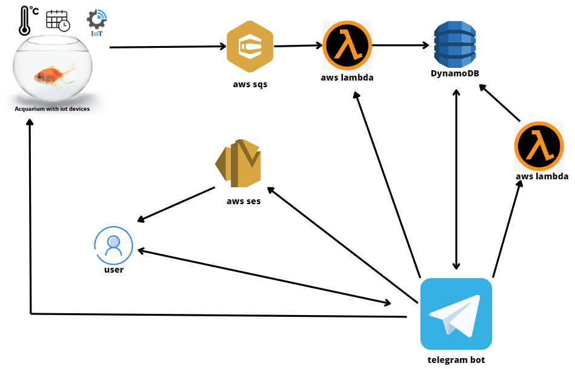

# AquaR.IoT ES: A Serverless Enhanced Aquarium with IoT ESP32 Board, AWS Services, and Telegram Integration

# Abstract:
AquaR.IoT ES (Enhanced Serverless) is a captivating project that showcases the fusion of IoT, serverless programming, and cloud integration to create a cutting-edge aquarium experience. This project, in his standard version (here's the repo: <url>https://github.com/brataccas99/acquar.iot</url>), features a fully functional aquarium populated with mesmerizing red fishes, equipped with an IoT ESP32 board, an array of sensors, motors, clocks, bridges, and other IoT components. By leveraging the power of the Zerynth platform, Python, and Zerynth Cloud, users can remotely interact with the aquarium, issuing commands such as feeding the fishes, oxygen regeneration, and water cleaning while effortlessly gathering valuable statistical data through Ubidots.

In this enhanced version, AquaR.IoT ES embraces the advancements in technology by migrating from Zerynth to AWS services for serverless programming. Leveraging AWS Lambda and DynamoDB, the project achieves a more scalable, efficient, and streamlined architecture. Additionally, a Telegram bot replaces the previous Zerynth Cloud functionality, enabling users to effortlessly send commands to the aquarium via AWS Lambda's seamless integration with the popular messaging platform.

AquaR.IoT ES represents a remarkable integration of cutting-edge technologies, enabling a fascinating and interactive aquarium experience that exemplifies the potential of IoT, serverless programming, and cloud integration.

## Architecture

There are some devices (simulated) that send datas to SQS queues and a lambda function that could be triggered manually. All the datas are accessed by a Telegram bot. This bot can trigger IoT sensors and the lambda for store datas. It can also switch on or off sensors. It also offers a way to send recap emails to the user.

## Prerequisite
- docker
- Node.js
- A telegram bot token and chat id
- all the requirements to run a python bot (telebot etc..)

## How to run this project

- MANDATORY: create a telegram bot (from @botfather), retireve his chat id and put them in the .env file respectively, also put your aws ses verified email in the respective .env field

## Easy way: One command setup

- clone this repo: <code>https://github.com/brataccas99/acquar.iot-es</code>

- write into a terminal from the root folder <code>aws ses verify-email-identity --email-address <your_email_address> --endpoint-url="http://localhost:4566"</code>

- run code <code>pip install -r requirements.txt</code>

- run <code>npm run firststart</code>

- Open telegram and connect to your binded bot

- enjoy

## Dev way: multiple command setup

- clone this repo: <code>https://github.com/brataccas99/acquar.iot-es</code>
- run <code>docker run -d --rm -p 4566:4566 --name aws localstack/localstack:1.4</code>
- run <code>npm install</code>
- go into <code>deploy</code> and re-run the command above
- run code <code>pip install -r requirements.txt</code>
- in the root directory run <code>npm run build</code> (or if you're lazy just run <code>npm run serve</code> and proceed to the email verification step)
- run <code>npm run start</code>
- run <code>npm run setup</code>
- run <code>.\copy.bat</code>
- verify your email with: <code>aws ses verify-email-identity --email-address <your-email> --endpoint-url="http://localhost:4566"</code>

After this, setup all the lamba functions:

- <code>aws iam create-role --role-name lambdarole --assume-role-policy-document file://role_policy.json --query 'Role.Arn' --endpoint-url=http://localhost:4566</code>
- <code> aws iam put-role-policy --role-name lambdarole --policy-name lambdapolicy --policy-document file://policy.json --endpoint-url=http://localhost:4566</code> 

And then create the functions:

- <code>aws lambda create-function --function-name offSensors --zip-file fileb://functions.zip --handler deploy/offSensors.lambdaHandler --runtime nodejs18.x --role arn:aws:iam::000000000000:role/lambdarole --endpoint-url=http://localhost:4566</code>

- <code>aws lambda create-function --function-name onSensors --zip-file fileb://functions.zip --handler deploy/onSensors.lambdaHandler --runtime nodejs18.x --role arn:aws:iam::000000000000:role/lambdarole --endpoint-url=http://localhost:4566</code>
  
- <code>aws lambda create-function --function-name offSensorAcquarium --zip-file fileb://functions.zip --handler deploy/offSensorAcquarium.lambdaHandler --runtime nodejs18.x --role arn:aws:iam::000000000000:role/lambdarole --endpoint-url=http://localhost:4566</code>

- <code>aws lambda create-function --function-name onSensorAcquarium --zip-file fileb://functions.zip --handler deploy/onSensorAcquarium.lambdaHandler --runtime nodejs18.x --role arn:aws:iam::000000000000:role/lambdarole --endpoint-url=http://localhost:4566</code>

- <code>aws lambda create-function --function-name generateO2 --zip-file fileb://functions.zip --handler deploy/generateO2.lambdaHandler --runtime nodejs18.x --role arn:aws:iam::000000000000:role/lambdarole --endpoint-url=http://localhost:4566</code>

- <code>aws lambda create-function --function-name giveFoodAcquarium --zip-file fileb://functions.zip --handler deploy/giveFoodAcquarium.lambdaHandler --runtime nodejs18.x --role arn:aws:iam::000000000000:role/lambdarole --endpoint-url=http://localhost:4566</code>

- <code>aws lambda create-function --function-name waterClean --zip-file fileb://functions.zip --handler deploy/waterClean.lambdaHandler --runtime nodejs18.x --role arn:aws:iam::000000000000:role/lambdarole --endpoint-url=http://localhost:4566</code>

- start the bot by typing: <code>python bot/bot.py</code>

# Further details

- the python bot has some scheduled job in order to give fishes the best of their life and receive notifications when an automatic action is performed 
- there are some specific 'command & control' lambda services for actions to a single acquarium and some for every acquarium
- all the fishes were so happy to live into these acquariums living their best life (for reference see videos of them in the standard project version)

# Future work

- adapt this project to work into a real world acquarium (as it's standard version)
- more unit tests (and complete what's not)
- more features for fishes games
- migration from localstack to aws services
- dedicated mobile app with chatbot (replacing the telegram bot)
- introducing AI && ML services from aws iot to prevent infection and bacteria contained in the water
- more fishes!  
